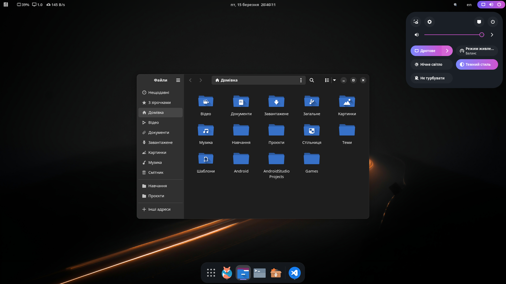

# Violet Dusk (Gnome Theme)

Violet Dusk repository has [Ukrainian :ukraine:](#мова-програмування-based-ukraine) and [English :uk:](#programming-language-based-uk) localizations

**_Quickly navigate between sections:_**

- [Violet Dusk (Gnome Theme)](#violet-dusk-gnome-theme)
  - [Violet Dusk :ukraine:](#violet-dusk-ukraine)
    - [Про проєкт](#про-проєкт)
    - [Скриншоти](#скриншоти)
    - [Інструкція](#інструкція)
    - [Джерела](#джерела)
  - [Violet Dusk :uk:](#violet-dusk-uk)
    - [About](#about)
    - [Screenshots](#screenshots)
    - [Instructions](#instructions)
    - [Sources](#sources)

## Violet Dusk :ukraine:

### Про проєкт

Цей репозиторій містить скрипт Install.sh, який автоматизує процес встановлення кастомної теми оформлення Violet Dusk на дистрибутиви Linux із середовищем стільниці GNOME. Violet Dusk – це збірка, що включає тему іконок Oranchelo та тему для GTK3/4 Lavanda-Dark.

Встановлення теми оформлення вручну може бути трудомістким процесом, що вимагає виконання безлічі команд і налаштувань. Цей скрипт спрощує весь процес, об'єднуючи всі необхідні кроки в один автоматизований крок. Завдяки цьому репозиторію ви зможете легко змінити зовнішній вигляд робочого середовища.

### Скриншоти

<p align='center'>
  
  <em>Скриншот 1</em>
</p>

<p align='center'>
  
  <em>Скриншот 2</em>
</p>

<p align='center'>
  
  <em>Скриншот 3</em>
</p>

### Інструкція

Для встановлення теми Violet Dusk за допомогою скрипту Install.sh виконайте наступні кроки:

1. Клонуйте репозиторій на свій комп'ютер:

```bash
git clone https://github.com/NikitaBerezhnyj/Flat_Lavanda
```

1. Перейдіть у директорію проєкту:

```bash
cd Flat_Lavanda
```

1. Запустіть скрипт встановлення:

```bash
sh ./Install.sh
```

Скрипт автоматично завантажить і встановить необхідні компоненти теми, включаючи GTK3/4 тему Lavanda-gtk-theme і набір іконок Oranchelo. Під час встановлення ви побачите повідомлення, які інформуватимуть вас про поточний стан процесу.

### Джерела

**_GTK3/4 Theme (Dark-Lavanda):_**

- GitHub: [https://github.com/vinceliuice/Lavanda-gtk-theme](https://github.com/vinceliuice/Lavanda-gtk-theme)
- GnomeLook: [https://www.gnome-look.org/p/1944780](https://www.gnome-look.org/p/1944780)

**_Icons Theme (Oranchelo):_**

- GitHub: [https://github.com/OrancheloTeam/oranchelo-icon-theme](https://github.com/OrancheloTeam/oranchelo-icon-theme)
- GnomeLook: [https://www.gnome-look.org/p/1015801/](https://www.gnome-look.org/p/1015801/)

---

## Violet Dusk :uk:

### About

This repository contains the Install.sh script that automates the process of installing the Violet Dusk custom design theme on Linux distributions with the GNOME desktop environment. Violet Dusk is a collection that includes the Oranchelo icon theme and the Lavanda-Dark theme for GTK3/4.

Installing a theme manually can be a time-consuming process that requires a lot of commands and settings. This script simplifies the whole process by combining all the necessary steps into one automated step. Thanks to this repository, you can easily change the appearance of your workspace.

### Screenshots

<p align='center'>
  
  <em>Скриншот 1</em>
</p>

<p align='center'>
  
  <em>Скриншот 2</em>
</p>

<p align='center'>
  
  <em>Скриншот 3</em>
</p>

### Instructions

To install the Violet Dusk theme using the Install.sh script, follow these steps:

1. Clone the repository to your computer:

```bash
git clone https://github.com/NikitaBerezhnyj/Flat_Lavanda
```

1. Change to the project directory:

```bash
cd Flat_Lavanda
```

1. Run the installation script:

```bash
sh ./Install.sh
```

The script will automatically download and install the necessary components of the theme, including the GTK3/4 theme Lavanda-gtk-theme and the Oranchelo icon set. During the installation, you will see messages informing you of the current status of the process.

### Sources

**_GTK3/4 Theme (Dark-Lavanda):_**

- GitHub: [https://github.com/vinceliuice/Lavanda-gtk-theme](https://github.com/vinceliuice/Lavanda-gtk-theme)
- GnomeLook: [https://www.gnome-look.org/p/1944780](https://www.gnome-look.org/p/1944780)

**_Icons Theme (Oranchelo):_**

- GitHub: [(https://github.com/OrancheloTeam/oranchelo-icon-theme)](https://github.com/OrancheloTeam/oranchelo-icon-theme)
- GnomeLook: [https://www.gnome-look.org/p/1015801/](https://www.gnome-look.org/p/1015801/)
